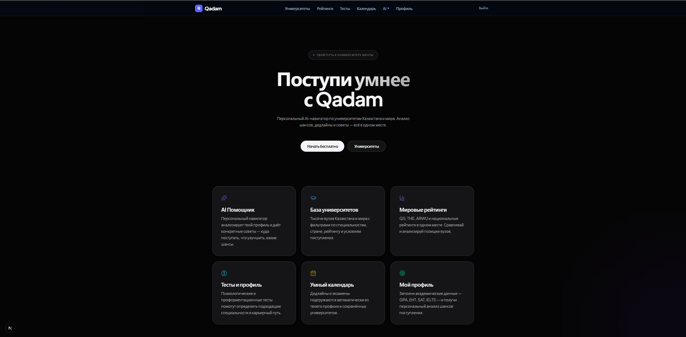
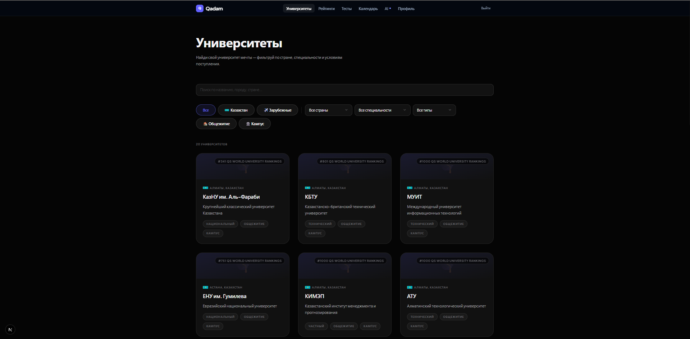
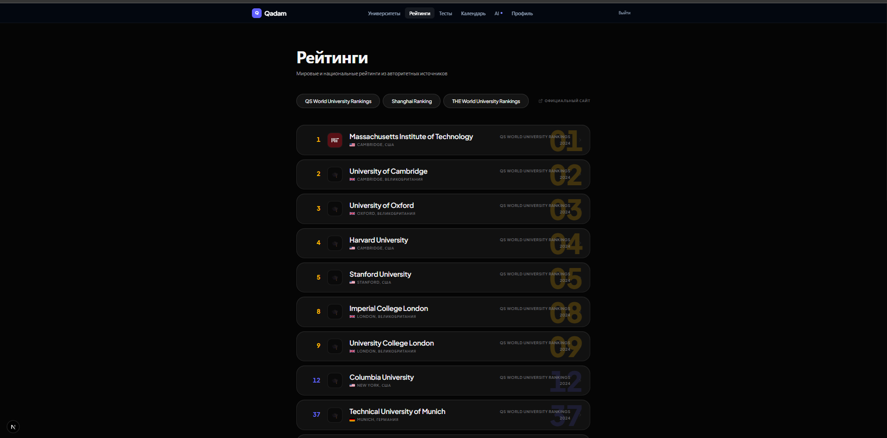
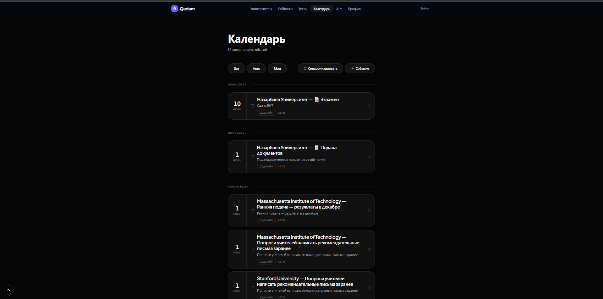

<h1 align="center">Qadam</h1>

<p align="center">
  <strong>AI-powered university application platform for students in Kazakhstan and beyond</strong>
</p>

<p align="center">
  <a href="#features">Features</a> &nbsp;&bull;&nbsp;
  <a href="#tech-stack">Tech Stack</a> &nbsp;&bull;&nbsp;
  <a href="#getting-started">Getting Started</a> &nbsp;&bull;&nbsp;
  <a href="#screenshots">Screenshots</a>
</p>

<br />

## About

**Qadam** (Kazakh: "Step") is a smart platform that helps high school students navigate the university application process. It combines a comprehensive university database, global rankings, deadline tracking, and an AI assistant to provide personalized guidance.

Whether you're applying to Kazakh national universities or top international schools like MIT and Harvard — Qadam helps you stay organized and make informed decisions.

<br />

## Screenshots

<table>
  <tr>
    <td></td>
    <td></td>
  </tr>
  <tr>
    <td><em>Landing page</em></td>
    <td><em>University catalog with filters & flags</em></td>
  </tr>
  <tr>
    <td></td>
    <td></td>
  </tr>
  <tr>
    <td><em>Global university rankings (QS, THE, Shanghai)</em></td>
    <td><em>Smart calendar with auto-generated deadlines</em></td>
  </tr>
</table>

<br />

## Features

- **University Database** — 100+ universities from Kazakhstan and around the world with detailed profiles, photos, campus info
- **Smart Search** — Fuzzy search powered by PostgreSQL `pg_trgm` with Russian name support (`MIT` / `Массачусетский`)
- **Global Rankings** — QS, THE, Shanghai (ARWU) rankings with filtering and comparison
- **Smart Calendar** — Auto-generated events based on your profile, saved universities, and deadlines
- **Event Templates** — Admin-configurable calendar templates with conditional logic (no code changes needed)
- **AI Assistant** — Personalized university recommendations and readiness analysis based on your academic profile
- **Academic Profile** — Track GPA, ENT, IELTS, SAT, TOEFL scores with validation
- **Deadline Tracking** — University-specific deadlines with "Add to Calendar" functionality
- **Admin Panel** — Full CRUD for universities, deadlines, rankings, and event templates
- **Dark Theme** — Modern, premium dark UI inspired by Vercel/Linear/Raycast

<br />

## Tech Stack

| Layer | Technology |
|-------|-----------|
| **Framework** | [Next.js 15](https://nextjs.org/) (App Router) |
| **Language** | [TypeScript](https://www.typescriptlang.org/) |
| **Styling** | [Tailwind CSS 4](https://tailwindcss.com/) |
| **Database** | [Supabase](https://supabase.com/) (PostgreSQL + Auth + RLS) |
| **Animations** | [Framer Motion](https://www.framer.com/motion/) |
| **AI** | [OpenAI API](https://openai.com/) |
| **Icons** | [Lucide React](https://lucide.dev/) |
| **Date Picker** | [React Day Picker](https://react-day-picker.js.org/) + [date-fns](https://date-fns.org/) |
| **Font** | [Plus Jakarta Sans](https://fonts.google.com/specimen/Plus+Jakarta+Sans) |

<br />

## Getting Started

### Prerequisites

- Node.js 18+
- npm or yarn
- Supabase project ([create one here](https://supabase.com/))

### Installation

```bash
# Clone the repository
git clone https://github.com/romans0506/Qadam.git
cd Qadam

# Install dependencies
npm install

# Set up environment variables
cp .env.example .env.local
```

### Environment Variables

Create a `.env.local` file with:

```env
NEXT_PUBLIC_SUPABASE_URL=your_supabase_url
NEXT_PUBLIC_SUPABASE_ANON_KEY=your_supabase_anon_key
OPENAI_API_KEY=your_openai_api_key
```

### Development

```bash
npm run dev
```

Open [http://localhost:3000](http://localhost:3000) in your browser.

<br />

## Project Structure

```
src/
├── app/                    # Next.js App Router pages
│   ├── admin/              # Admin panel (universities, deadlines, rankings, templates)
│   ├── assistant/          # AI assistant page
│   ├── calendar/           # Smart calendar
│   ├── login/              # Authentication
│   ├── profile/            # User profile
│   ├── rankings/           # University rankings
│   ├── tests/              # Psychometric tests
│   └── universities/       # University catalog & detail pages
├── components/
│   ├── profile/            # Profile-related components
│   ├── ui/                 # Shared UI (CustomSelect, DatePicker, Header)
│   └── universities/       # University cards, filters, buttons
├── services/               # Business logic (calendar, university, profile services)
├── types/                  # TypeScript interfaces
└── lib/                    # Supabase client setup
```

<br />

## Database

The app uses **Supabase (PostgreSQL)** with Row-Level Security. Key tables:

- `universities` — University profiles with `name_ru`, `aliases` for multilingual search
- `university_deadlines` — Application deadlines per university
- `university_rankings` — Ranking positions from multiple sources
- `user_calendar_events` — User's calendar (manual + auto-generated)
- `event_templates` — Configurable templates for auto-generating calendar events
- `profiles` — User academic data (GPA, test scores, goals)

PostgreSQL extensions: `pg_trgm` for fuzzy text search.

<br />

## Author

**Roman Stepanenko** — [@romans0506](https://github.com/romans0506)

<br />

---

<p align="center">
  Built with Next.js, Supabase, and a lot of ambition.
</p>
